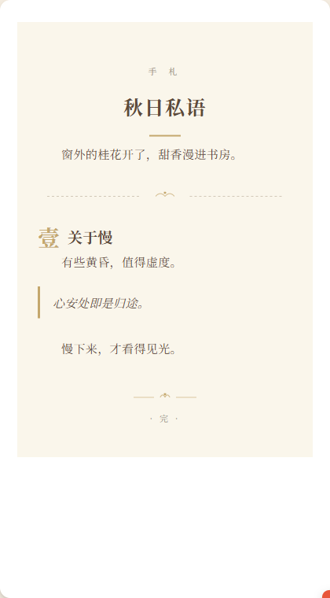
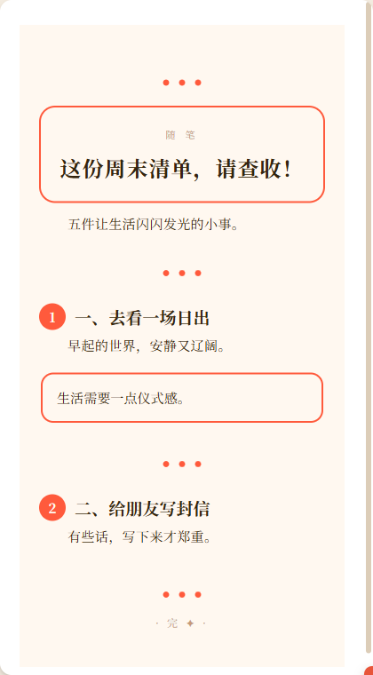
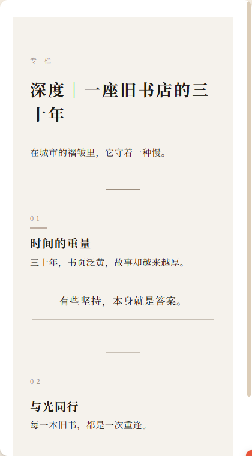
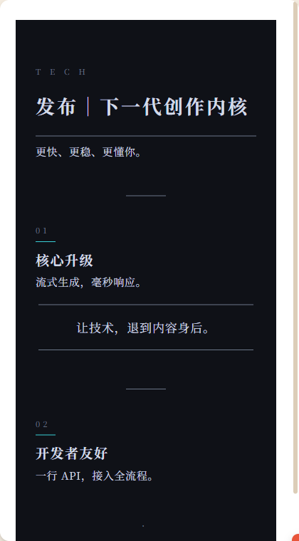
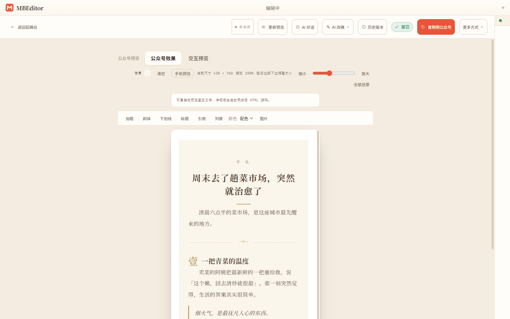

<div align="center">

# MBEditor

### 自托管的 AI 公众号创作工具

**说一句你的想法，AI 帮你写出一篇好看的推文。**

[](LICENSE)
[](docker-compose.yml)
[](#第三步配置-ai-模型byok)
[](skill/mbeditor.skill.md)
[](https://github.com/AAAAAnson/mbeditor/releases/latest)

</div>

---


## 为什么做了这个

写公众号最累的不是想法，是排版。

MBEditor 想让这件事变简单:**输入一句话，AI 流式生成一整篇排版好看的推文，预览即所得，一键存草稿。** 模型自带（BYOK，如 DeepSeek）——你的 API key 只存在自己的机器上，不经过任何第三方。

写完不满意，还能接着改:选中一段让 AI 润色，或者直接对话「把开头写得更轻松点」「整体换个调子」——像和一个懂排版的编辑聊天。

而且它天生**为 AI Agent 设计**:每个功能都是一个 API 端点。你可以在 Claude Code 里说一句「写一篇 Docker 入门推文，杂志风排版，发到草稿箱」，剩下的交给 Agent。

## 四个核心能力

<table>
<tr>
<td width="25%">

**一句话 AI 写作**

输入一个主题，AI 流式生成整篇排版好的推文。按「调子」分派多套结构性不同的版式，不是只换配色。模型自带（BYOK），key 只存本地。

</td>
<td width="25%">

**AI 改稿 · 对话式编辑**

选中段落让 AI 润色 / 缩短 / 换说法；或用自然语言对话指挥修改。原生 function calling、块级增量更新，改写不会丢图片和 SVG。

</td>
<td width="25%">

**所见即所得**

预览画布就是编辑器，直接在公众号样式下改文字。文章背景色可一键设置、随复制保留；复制到公众号，粘贴效果 = 预览效果。

</td>
<td width="25%">

**内容安全 · 一键发布**

文章后端持久化 + 版本历史 + 回收站，改坏了能回退。一键复制富文本或推送到公众号草稿箱，自动上传图片到微信 CDN。

</td>
</tr>
</table>

> 还是 **Agent 优先**:完整 RESTful API + Typer CLI + Skill 文件，Claude Code / Codex / OpenClaw 任意一个 Agent 都能直接操控编辑器，适合 CI/CD、定时任务、批量生产。

## 五套排版调子

一句话生成时 AI 会按内容气质自动选版式；也可以在「套个好看模板」里手动挑，或通过 CLI / API 一键导入。全部纯 inline `<section>` + SVG 装饰，100% 过微信 sanitizer 白名单。

<table>
<tr>
<td align="center" width="20%"><strong>极简商务</strong><br/>行业报告 / 企业通告</td>
<td align="center" width="20%"><strong>文艺手札</strong><br/>散文 / 读书笔记</td>
<td align="center" width="20%"><strong>活力撞色</strong><br/>生活清单 / 品牌活动</td>
<td align="center" width="20%"><strong>杂志专栏</strong><br/>深度报道 / 人物专访</td>
<td align="center" width="20%"><strong>科技霓虹</strong><br/>产品发布 / 科技资讯</td>
</tr>
<tr>
<td></td>
<td></td>
<td></td>
<td></td>
<td></td>
</tr>
</table>

> 模板源文件在 `docs/cli/examples/templates/tpl_*.json`，每篇 ≥ 1500 字，内容全是具体事实或研究数据，可以直接拿来练手 / 做对标。

## 快速开始

### 第一步：部署 MBEditor

```bash
git clone https://github.com/AAAAAnson/mbeditor.git
cd mbeditor
docker compose up -d
```

部署完成后：
- **编辑器界面**：http://localhost:7073
- **API 接口**：http://localhost:7072/api/v1

> 升级只需 `git pull && docker compose up --build -d`，不会丢数据——文章和图片存在 `data/` 目录 + Docker 具名卷里，不受容器重建影响。

### 第二步：配置 AI 模型（BYOK）

打开编辑器 → 「设置 → AI 引擎」，填入你自己的模型 API key（如 DeepSeek）。key 只存在后端具名卷，**不经过任何第三方**。配好后，在起稿台输入一句话即可流式生成整篇推文。

### 第三步：安装 Agent 技能（可选）

`skill/mbeditor.skill.md` 安装后，AI Agent 就能直接操控编辑器。

<details open>
<summary><strong>Claude Code</strong></summary>

**项目级（推荐）** — 在 MBEditor 目录下直接用，Agent 自动发现 skill：

```bash
cd mbeditor
claude "帮我写一篇关于 Docker 的推文，推到草稿箱"
```

**全局安装** — 任意目录可用：

```bash
# macOS / Linux
mkdir -p ~/.claude/skills
cp skill/mbeditor.skill.md ~/.claude/skills/mbeditor.skill.md

# Windows
mkdir %USERPROFILE%\.claude\skills
copy skill\mbeditor.skill.md %USERPROFILE%\.claude\skills\mbeditor.skill.md
```

</details>

<details>
<summary><strong>Codex</strong></summary>

```bash
mkdir -p ~/.codex/agents
cp skill/mbeditor.skill.md ~/.codex/agents/mbeditor.skill.md

codex "部署微信编辑器，然后写一篇推文发到草稿箱"
```

</details>

<details>
<summary><strong>OpenClaw</strong></summary>

```bash
openclaw skill add ./skill/mbeditor.skill.md

openclaw "写一篇公众号推文，主题是 Docker 入门"
```

</details>

> **默认端口**：Docker 部署下 API 在 `7072`，编辑器在 `7073`。

### 第四步：连接微信公众号（可选）

要一键推草稿箱，在「设置 → 公众号」填 AppID / AppSecret 并保存。AppSecret 写入后端具名卷（按 appid，**写后不回显**），刷新免重输;也可调 API：

```bash
curl -X PUT http://localhost:7072/api/v1/settings/credentials \
  -H "Content-Type: application/json" \
  -d '{"appid":"wx你的appid","appsecret":"你的appsecret"}'
```

凭据存 Docker 具名卷 `mbeditor-data:/app/data/credentials.json`（明文 + chmod 600、仓库树外）——永远不会进 git。

> **推草稿报「非白名单 IP」？** 公众号 API 卡的是出口 IP。若服务器出口 IP 不便加白名单，可在「设置 → 发布服务器」配置一台固定 IP 的中转网关。详见 [Wiki › 微信网关配置](https://github.com/AAAAAnson/mbeditor/wiki/WeChat-Gateway)。

## Agent 工作流

MBEditor 的每个操作都是一个 REST API 端点，Agent 全程无需打开浏览器：

```bash
# 1. 套用"极简商务"模板创建文章并写入内容
TEMPLATE=docs/cli/examples/templates/tpl_biz_minimal.json
ID=$(curl -s -X POST http://localhost:7072/api/v1/articles \
     -H 'Content-Type: application/json' \
     -d "$(python -c "import json;d=json.load(open('$TEMPLATE',encoding='utf-8'));print(json.dumps({'title':d['title'],'mode':d['mode']}))")" \
     | python -c "import json,sys;print(json.load(sys.stdin)['data']['id'])")

curl -s -X PUT "http://localhost:7072/api/v1/articles/$ID" \
  -H 'Content-Type: application/json' -d @"$TEMPLATE"

# 2. 推送到微信草稿箱（stateless：带上公众号凭据 + 文章内容，正文图片自动传微信 CDN）
curl -s "http://localhost:7072/api/v1/articles/$ID" \
  | python -c "import json,sys;a=json.load(sys.stdin)['data']['article'];print(json.dumps({'appid':'wx你的appid','appsecret':'你的appsecret','article':a}))" \
  | curl -s -X POST http://localhost:7072/api/v1/wechat/draft -H 'Content-Type: application/json' -d @-
```

或者一句话搞定：

```bash
claude "套用极简商务模板写一篇 Q2 行业观察，推到草稿箱"
```

## 编辑器功能



### 三种编辑方式

| 模式 | 适合谁 | 能做什么 |
|------|--------|---------|
| **所见即所得** | 所有人 | 直接在预览里改文字，停顿后自动回写源码；一键设置文章背景色 |
| **Markdown 模式** | 写作者 | 用最简洁的语法写作，服务端自动编译成 HTML 同步预览 |
| **HTML 模式** | 设计师 / Agent | HTML + CSS + JS 三栏编辑（可拖拽自由调宽），像素级控制每个元素 |

### AI 协作

- **一句话生成**:起稿台输入想法，AI 流式产出整篇排版好的推文（BYOK）。
- **选中即改**:预览里选一段 → 润色 / 缩短 / 换个说法 / 自由指令，流式替换，采用 / 再来一版 / 还原。
- **对话式编辑**:用自然语言指挥修改整篇——换调子、缩长度、改背景色，块级增量更新。
- **媒体守恒**:AI 改写永远不会丢失文中的图片 / SVG（改写让媒体总数变少会被硬拦截并回退）。

### 内容安全

- **版本历史**:每次 AI 改写 / 恢复前自动落快照，随时回退。
- **回收站**:删除是软删，可恢复;彻底清除才真正删。
- **后端持久化**:文章存后端（离线可写、重连补同步），不再只存浏览器。

### 发布

- 一键复制富文本到剪贴板，预览效果 = 粘贴效果;或一键推送到微信草稿箱，自动上传图片到微信 CDN。
- CSS 自动内联化 + 基础排版样式注入，`<section>` / SVG / 内联 `style` 全保留;发布前对 SVG-SMIL 动画等微信不支持的写法给出预警。

## 推荐搭配技能

MBEditor 负责编辑和发布，排版设计和内容风格可以搭配以下技能:

| 技能 | 用途 | 链接 |
|-------|------|------|
| **Anthropic Frontend Design** | 排版设计风格 — 生成有设计感的 HTML 排版，告别 AI 味 | [anthropics/skills/frontend-design](https://github.com/anthropics/skills/tree/main/skills/frontend-design) |
| **Khazix Skills** | 内容写作风格 — 公众号长文写作、个人风格化输出 | [KKKKhazix/khazix-skills](https://github.com/KKKKhazix/khazix-skills) |

> 搭配使用:Khazix 负责内容、Frontend Design 负责排版、MBEditor 负责预览和发布——从写作到草稿箱全链路自动化。

## 技术栈

| 前端 | 后端 | 部署 |
|------|------|------|
| React 19 + TypeScript | FastAPI + Python 3.11 | Docker Compose |
| Tailwind CSS 4 + Zustand | premailer（CSS 内联化） | Nginx 反代 |
| 可编辑预览 + Monaco | SSE 流式 AI（BYOK） | `docker compose up -d` 一键启 |
| 亮/暗两套暖调主题 + 字体族切换 | 微信公众号 API | 端口 7073 / 7072 |

## API 参考

<details>
<summary><strong>完整 API 端点列表</strong></summary>

### 文章 / 版本

| 方法 | 端点 | 说明 |
|------|------|------|
| `POST` / `GET` | `/api/v1/articles` | 创建 `{title, mode}` / 列出全部 |
| `GET` / `PUT` / `DELETE` | `/api/v1/articles/{id}` | 获取 / 更新 / 软删（`?purge=true` 彻底删） |
| `POST` | `/api/v1/articles/{id}/restore` | 从回收站恢复 |
| `GET` | `/api/v1/revisions/{id}` | 文章的版本快照列表 / 单个版本 |

### AI（BYOK，SSE 流式）

| 方法 | 端点 | 说明 |
|------|------|------|
| `POST` | `/api/v1/agent/write` | 一句话生成整篇推文 |
| `POST` | `/api/v1/agent/rewrite` | 改稿:标题 / 摘要 / 块级 / 整篇 |
| `POST` | `/api/v1/agent/chat` | 对话式编辑（原生 function calling） |

### 发布 / 微信

| 方法 | 端点 | 说明 |
|------|------|------|
| `POST` | `/api/v1/publish/preview` | 预览处理（CSS 内联化） |
| `POST` | `/api/v1/publish/process-for-copy` | 复制前处理（正文图片转微信 CDN） |
| `POST` | `/api/v1/wechat/draft` | 推送到草稿箱（stateless：带凭据 + 文章） |
| `POST` | `/api/v1/wechat/upload-image` | 上传单图到微信素材（form：appid/appsecret/file） |
| `POST` | `/api/v1/wechat/test-connection` | 测试公众号凭据可用性 |

### 配置 / 版本

| 方法 | 端点 | 说明 |
|------|------|------|
| `GET` / `PUT` | `/api/v1/settings/credentials` | 公众号 AppSecret（按 appid，写后不回显） |
| `GET` / `PUT` / `POST` | `/api/v1/settings/gateway`(`/test`) | 中转网关配置（令牌 / 证书写后不回显） |
| `GET` | `/api/v1/version` | 当前版本 `{version, repo}` |

</details>

## 项目结构

```
mbeditor/
├── frontend/               # React 19 + TypeScript + Tailwind 4
│   └── src/
│       ├── surfaces/       # editor / home / settings
│       ├── components/     # UI 原子组件 + icons
│       └── stores/         # uiStore / articlesStore（Zustand）
├── backend/                # FastAPI + Python
│   └── app/
│       ├── api/v1/         # REST API 路由（articles / agent / publish / settings）
│       ├── cli/            # Typer CLI
│       └── services/       # 文章 / 图片 / AI 编排 / 微信 API / renderers
├── skill/                  # AI Agent Skill 定义
│   └── mbeditor.skill.md   # Claude Code / Codex / OpenClaw 兼容
├── docs/
│   ├── cli/examples/templates/  # 五套示例模板 tpl_*.json
│   └── screenshots/        # README 截图
├── docker-compose.yml      # 一键部署
└── LICENSE                 # MIT
```

## 本地开发

```bash
# 后端
cd backend
uv sync            # 或 pip install -e .
uvicorn app.main:app --reload --port 7072

# 前端（新终端）
cd frontend && npm install && npm run dev
```

## 贡献

欢迎提交 [Issue](https://github.com/AAAAAnson/mbeditor/issues) 和 [Pull Request](https://github.com/AAAAAnson/mbeditor/pulls)。

<a href="https://github.com/AAAAAnson">
  
</a>

**[AAAAAnson](https://github.com/AAAAAnson)** — 创建者与维护者

## 许可证

[MIT](LICENSE) &copy; 2025 Anson

_专注内容，其他交给 MBEditor。_
